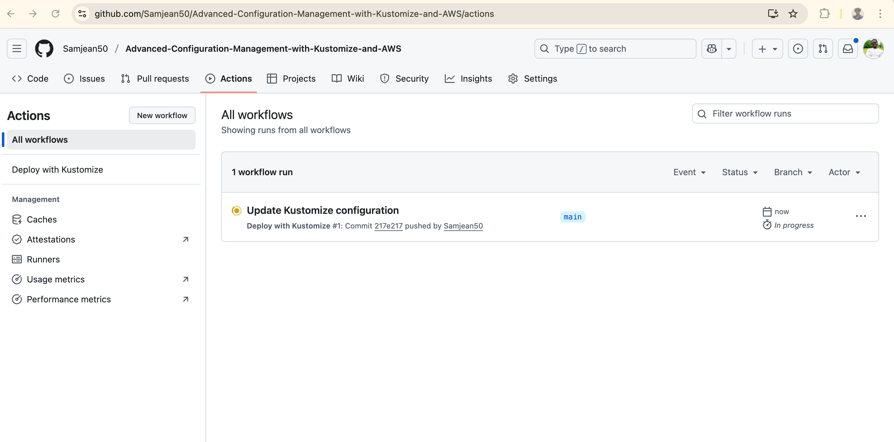

# Advanced Configuration Management with Kustomize and AWS
## Learning Objectives
This project aims to deepen your understanding of using Kustomize in Kubernetes, focusing on:

- Integration with CI/CD pipelines,
- Managing complex configurations, and
- Applying industry best practices for configuration management.

You will gain hands-on experience building an automated and scalable Kubernetes deployment workflow leveraging Kustomize, GitHub Actions, and Amazon EKS (Elastic Kubernetes Service).

## Prerequisites
1.	Basic Understanding of Kubernetes	Familiarity with Kubernetes concepts and resources.	Kubernetes Basics
2.	Kustomize	Essential for customizing Kubernetes configurations.	Install Kustomize
3.	Docker	Required for running containerized applications.	
4.	kubectl	CLI tool to interact with the Kubernetes cluster.	
5.	AWS CLI	Used to manage AWS services.
6.	eksctl	CLI tool for creating and managing EKS clusters.
7.	AWS Account	Required with IAM permissions to create/manage EKS resources.	
8.	Code Editor	Recommended for editing YAML files.
9.	Internet Connection	Required for downloading tools and interacting with AWS.	—
10.	Computer with Adequate Resources	Ensure your system can run EKS, Docker, and CLI tools smoothly.


## Project Structure
A typical directory structure for this project will look like this:

```
advanced-kustomize-and-aws
│
├── base/
│   ├── deployment.yaml
│   ├── service.yaml
│   └── kustomization.yaml
│
└── overlays/
    ├── dev/
    │   ├── replica_count_dev.yaml
    │   └── kustomization.yaml

    │
    ├── staging/
    │   ├── replica_count_staging.yaml
    │   └── kustomization.yaml
    │
    └── prod/
        ├── labels.yaml
        └── kustomization.yaml
```
## Lesson 1: Integrating Kustomize into a CI/CD Pipeline
#### Objective

Gain hands-on experience automating Kubernetes configuration management using Kustomize integrated with GitHub Actions CI/CD workflow.

### Step 1: Set Up GitHub Actions
- a. Create a Repository

Ensure you have a GitHub repository for your Kubernetes project containing Kustomize configurations.

#### Example structure:
```
.github/workflows/
base/
overlays/
```
- b. Create a Workflow File
In your repository, create:

```.github/workflows/main.yml```


### Step 2: Configure the CI/CD Pipeline
- a. Workflow Definition
Define the name and trigger event:

```
name: Deploy with Kustomize
on:
  push:
    branches:
      - main
```

- b. Define Jobs
Create a job named deploy running on Ubuntu:

```
jobs:
  deploy:
    runs-on: ubuntu-latest
    steps:
```

- c. Checkout Code
```
- name: Checkout
  uses: actions/checkout@v2
  ```

- d. Set Up Kubectl and Kustomize
```
- name: Set up Kubectl
  uses: azure/setup-kubectl@v1

- name: Set up Kustomize
  uses: imranismail/setup-kustomize@v1
```

- e. Apply Kustomize Configuration
```
- name: Deploy to Kubernetes
  run: |
    kubectl apply -k ./overlays/production/

```

#### Full Example Workflow
```
# .github/workflows/main.yml
name: Deploy with Kustomize

on:
  push:
    branches:
      - main

jobs:
  deploy:
    runs-on: ubuntu-latest
    steps:
      - name: Checkout
        uses: actions/checkout@v2
      - name: Set up Kubectl
        uses: azure/setup-kubectl@v1
      - name: Set up Kustomize
        uses: imranismail/setup-kustomize@v1
      - name: Deploy to Kubernetes
        run: |
          kubectl apply -k ./overlays/production/
```
 Note: Ensure your GitHub Actions runner has access to your Kubernetes cluster (for example, using AWS credentials or kubeconfig secrets).

### Step 3: Testing the CI/CD Pipeline
1. Make configuration changes

Modify a Kustomize overlay (e.g., update replica count or environment variable).

2. Commit and push changes
```
git add .
git commit -m "Update Kustomize configuration"
git push origin main
```

3. Observe pipeline execution

- Open the Actions tab in your GitHub repository.
- Watch the workflow run logs.
- Confirm changes are applied to your Kubernetes cluster.

### Step 4: Advanced (Optional)
a. Add Environment Variables or Secrets

Use GitHub Secrets for storing sensitive data:

- AWS_ACCESS_KEY_ID
- AWS_SECRET_ACCESS_KEY
- KUBE_CONFIG
  
b. Enhanced Workflow Triggers
Trigger workflows on:

- Pull requests
- Specific directory changes
- Tags or release events

## Lesson 2 — Handling Complex Configurations
#### Objective

Explore strategies for managing large-scale and complex Kubernetes configurations.

#### Tasks and Steps
- a. Organize Configuration Structure
Use a hierarchical directory structure for multi-app or multi-environment management:

```
apps/
├── frontend/
│   └── overlays/
├── backend/
│   └── overlays/
```
- b. Use Kustomize Features
  - Overlays — customize base configs for different environments
  - Patches — modify specific fields dynamically
  - Generators — generate ConfigMaps and Secrets on the fly

#### Example:
```
# overlays/production/kustomization.yaml
bases:
  - ../../base
patches:
  - replica-patch.yaml
configMapGenerator:
  - name: app-config
    literals:
      - LOG_LEVEL=INFO

  ```

## Lesson 4.3 — Best Practices and Tips
- Separate base and overlay directories clearly.
- Never hard-code secrets; use sealed secrets or GitHub Secrets.
- Use kustomize build locally to validate manifests before deployment.
- Automate validation and deployment steps through GitHub Actions.
- Use different overlays for staging, QA, and production.
- Keep your base configuration DRY (Don’t Repeat Yourself).

## Step Screen Shoots




## Expected Outcome
By the end of this project, you will:

- Understand advanced Kustomize concepts
- Implement automated CI/CD pipelines for Kubernetes deployments
- Manage complex multi-environment configurations
- Deploy workloads seamlessly to Amazon EKS


